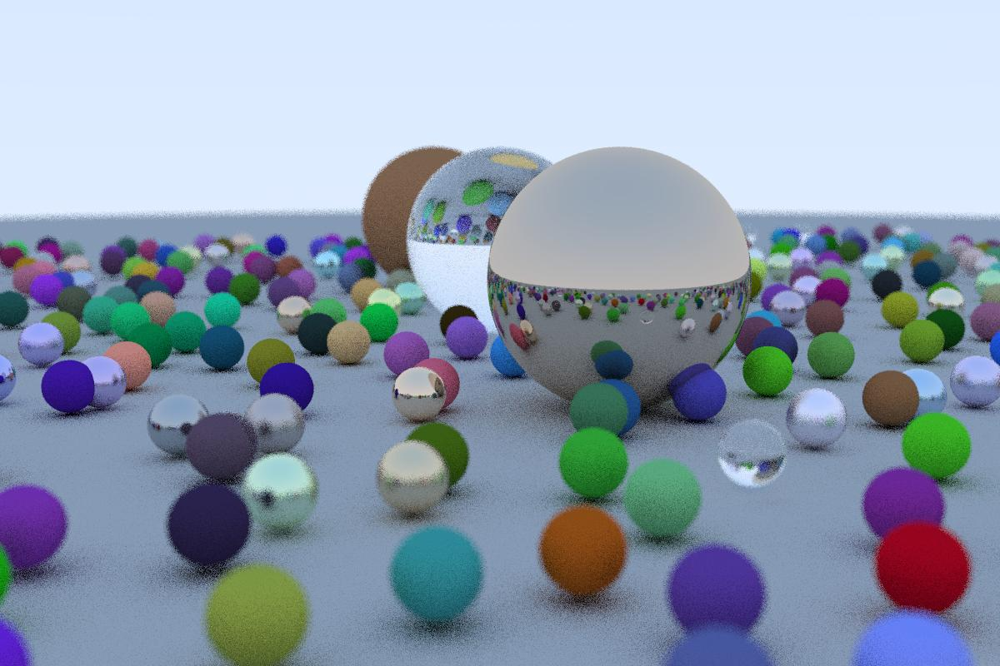

# CuRay: A PBRT Raytracer in CUDA

CuRay is a GPU-accelerated raytracer based on Peter Shirley's "Ray Tracing in One Weekend" book series. It extends the concepts introduced in the book to support advanced features and performance optimizations using CUDA.

## Key Features

CuRay supports the following features inspired by Peter Shirley's book series:

### 1. Material-sampled Path Tracing
CuRay implements material-sampled path tracing, allowing the simulation of complex materials and global illumination effects.

### 2. Materials
- **Diffuse, Glossy, and Transparent Materials**: CuRay supports various material types, including diffuse, glossy, and transparent materials for realistic surface interactions.
- **Metallic Surfaces**: It includes metallic surfaces with adjustable fuzziness for modeling roughness.
- **Dielectric Materials**: CuRay simulates dielectric materials with refraction and reflection, including effects like total internal reflection.
  
### 3. Camera Effects
- **Depth of Field**: CuRay includes depth of field effects, creating realistic out-of-focus blur.
- **Motion Blur**: It supports motion blur effects for moving objects in the scene.

### 4. CUDA Optimization

CuRay leverages the power of CUDA to accelerate rendering performance significantly. The introduction of CUDA parallelism and GPU optimization techniques has transformed rendering from taking approximately 90 seconds on an AMD Rysen 5600/RTX 3060 to just 2.5 seconds.
